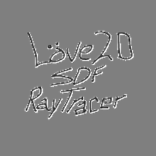
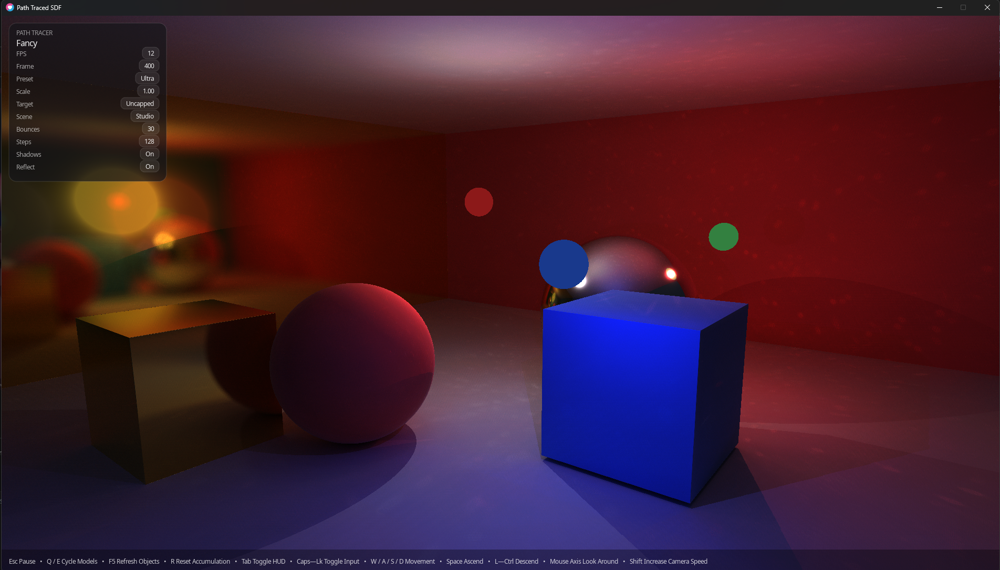
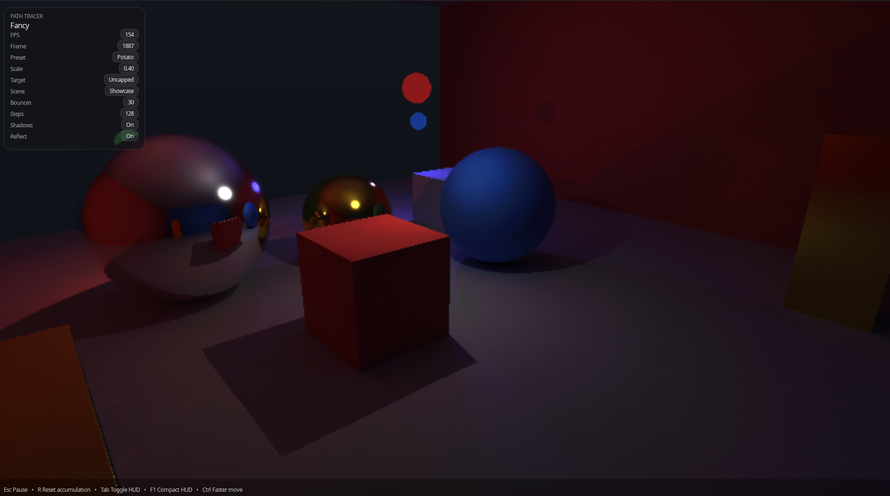

<div align="center">
  

# Love2D RayTracing Example

A compact interactive **SDF / ray / spectral toy renderer** built with **LOVE 12.0**, Lua, and GLSL.

It focuses on realtime experimentation: scene switching, progressive accumulation, runtime OBJ importing, and live tuning from the pause menu.
</div>

---

## Preview

<table>
  <tr>
    <td align="center">
      
      <br />
      <sub>Fancy / Showcase</sub>
    </td>
    <td align="center">
      
      <br />
      <sub>Potato / Showcase</sub>
    </td>
  </tr>
</table>

## What this is

This project is a shader-driven rendering playground that combines:

- signed distance field scenes
- progressive accumulation with a separate radiance-cache pass
- multiple tracing modes, from RGB previewing to spectral/path-traced rendering
- a runtime imported-object scene backed by an OBJ -> BVH -> texture-packing pipeline

It is built to be easy to run, easy to tweak, and easy to abuse.

## Current features

- **Five quality presets**: Potato, Low, Medium, High, Ultra
- **Five tracing modes**:
  - RGB Rasterization
  - RGB Ray Tracing
  - Spectral Ray Tracing
  - Spectral Path Tracing
  - Wave Optics Rendering
- **Four scene variants**:
  - Studio
  - Showcase
  - House of Mirrors
  - Imported Objects
- **Progressive accumulation** with camera-aware reset behavior
- **Radiance cache pass** used by the spectral transport path
- **Free-fly camera** with mouse look
- **HUD and compact HUD** plus a pause menu split into Render / Import / Governor pages
- **Adaptive runtime governor** for render scale, frame budget, dummy movement preview, and RAM/VRAM import limits
- **Recursive runtime OBJ browser** for the `objects/` folder
- **OBJ import pipeline** with MTL parsing, vertex-color support, missing-normal generation, triangle budgeting, BVH construction, and GPU texture packing

## Quick start

### Run from source

1. Install **LOVE 11.5**.
2. Clone or download this repository.
3. Put any test `.obj` files you want to browse into the `objects/` folder.
4. Run the project with:

```bash
love .
```

You can also drag the project folder onto the LOVE executable on Windows.

## Controls

### In scene

- `W A S D` - move
- `Mouse` - look around
- `Space` - move up
- `Left Ctrl` - move down
- `Left Shift` - move faster
- `Mouse Wheel` - cycle quality presets
- `Q / E` - cycle runtime OBJ models and focus the imported-object scene
- `F5` - rescan the `objects/` folder
- `R` - reset accumulation
- `Tab` - toggle HUD
- `F1` - toggle compact HUD
- `Caps Lock` - toggle input capture
- `Esc` - open pause menu

### In pause menu

- `Q / E` - switch Render / Import / Governor pages
- `W / S` or `Up / Down` - move selection
- `A / D` or `Left / Right` - adjust setting
- `Page Up / Page Down` - large step adjustments
- `Enter` / `Space` - activate an item or open a dropdown
- `Mouse` - hover and select
- `Mouse Wheel` - scroll dropdowns or adjust the current item
- `R` - reset accumulation
- `Esc` - close the pause menu or close the active dropdown

## Imported objects

The **Imported Objects** scene is the runtime mesh path, and at this point it is more than a simple preview toggle.

Notes:

- The browser scans `objects/` recursively and only loads `.obj` files right now.
- `.glb` files can sit in the folder, but they are currently ignored by the runtime browser.
- `.mtl` sidecars are parsed and converted into the renderer's packed material parameters.
- Per-vertex color is respected when present.
- Missing normals are generated automatically when needed.
- Dense meshes can be triangle-sampled to fit the active import budget.
- The imported scene is centered/scaled automatically, then uploaded as packed triangle, object, mesh, and BVH textures for the shader.
- Texture map paths are parsed from MTL files, but imported shading still comes from packed scalar/color material data rather than direct texture sampling.
- Current hard caps are **81,920 uploaded triangles**, **4,096 imported objects**, and **16,384 imported meshes** before softer RAM/VRAM budgeting kicks in.

## Project structure

```text
.
|-- .gitignore
|-- Fancy.png
|-- Love2D-SDF-RayTracer-LOGO.png
|-- governor.lua
|-- imported_scene.lua
|-- main.lua
|-- objloader.lua
|-- Potato.png
|-- README.md
|-- shader.glsl
|-- shared/
`-- objects/
```

### Important files

- `main.lua` - app flow, camera, HUD, pause menu, and render orchestration
- `shader.glsl` - built-in SDF scenes, tracing modes, imported-BVH traversal, and accumulation logic
- `imported_scene.lua` - imported-scene build pipeline, material packing, BVH construction, and GPU upload
- `objloader.lua` - OBJ/MTL parsing, filesystem scanning, and mesh assembly
- `governor.lua` - adaptive render-scale and memory-budget logic
- `shared/` - small math, path, and vector helpers
- `objects/` - local runtime OBJ drop folder

## Possible next steps

- direct texture sampling for imported materials
- clearer in-app reporting for import failures and active budgets
- more built-in scenes or saved camera presets
- denoising / temporal filtering experiments
- glTF / GLB support for the import path
- smarter low-end adaptive scaling

## License

```text
Don Source-Available Non-Derivative License (DSANDL) v1.2

See LICENSE.txt for the full license text.
```
